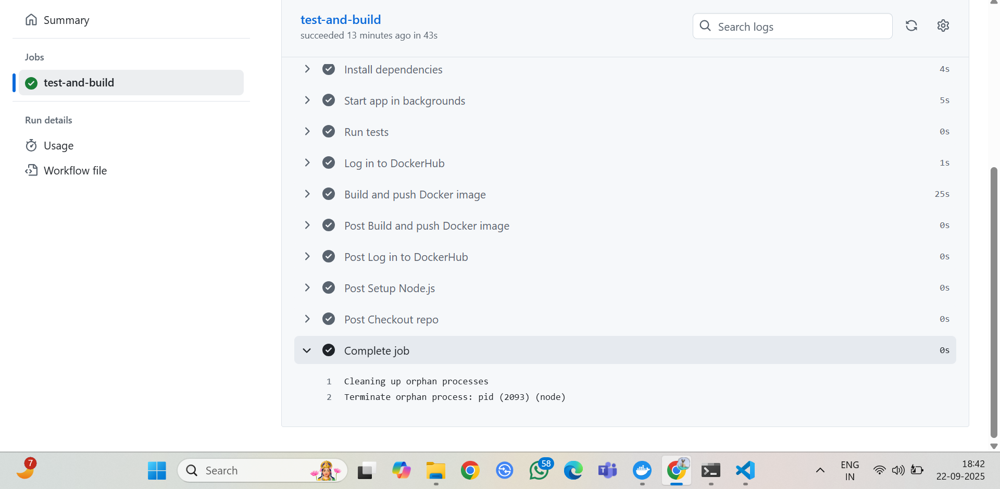
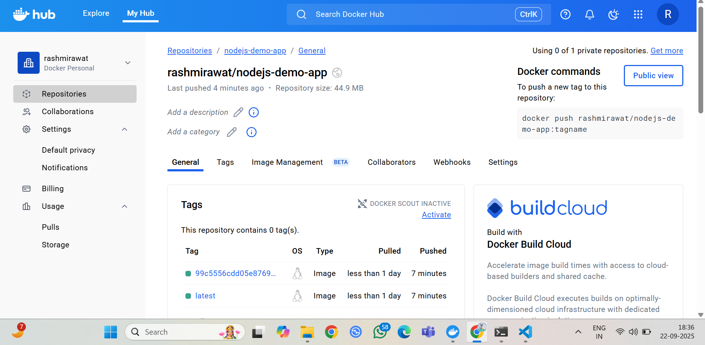

# NodeJS Demo App - CI/CD with GitHub Actions & Docker

This repository contains a simple **Node.js + Express** application that demonstrates a basic **CI/CD pipeline** using **GitHub Actions** and **Docker**.  
The pipeline installs dependencies, runs tests, builds a Docker image, and pushes it to DockerHub automatically.

---

## Prerequisites

Make sure you have the following installed on your machine:

- [Node.js](https://nodejs.org/) (version 18 or higher)
- [Git](https://git-scm.com/)
- [Docker](https://docs.docker.com/get-docker/) (Desktop or Engine)
- A [DockerHub](https://hub.docker.com/) account

---

## Setup & Run Locally

Clone this repository and install dependencies:

```bash
git clone https://github.com/rashmirawat1/nodejs-demo-app.git
cd nodejs-demo-app
npm install
```

Start the application:

```bash
npm start
```

Visit: [http://localhost:3000](http://localhost:3000)  
You should see:

```
Hello from nodejs-demo-app!
```

---

## Run Tests

Run the smoke test:

```bash
npm test
```

Exit code `0` = success.

---

## Docker Instructions

### Build Docker Image Locally
```bash
docker build -t nodejs-demo-app:local .
```

### Run the Container
```bash
docker run -p 3000:3000 nodejs-demo-app:local
```

Visit [http://localhost:3000](http://localhost:3000) again — you should see the same output.

---

## CI/CD Pipeline (GitHub Actions)

This project uses **GitHub Actions** workflow stored at `.github/workflows/main.yml`.  
Steps executed in the pipeline:

1. **Checkout Code** – Fetches the repository code.
2. **Install Dependencies** – Runs `npm install`.
3. **Start App & Run Tests** – Confirms the app runs successfully.
4. **Docker Build & Push** – Builds the image and pushes it to DockerHub:
   - `DOCKERHUB_USERNAME/nodejs-demo-app:latest`
   - `DOCKERHUB_USERNAME/nodejs-demo-app:<commit-sha>`

---

## 📸 Screenshots

### ✅ Successful Workflow Run


### 🐳 DockerHub Repository


---


